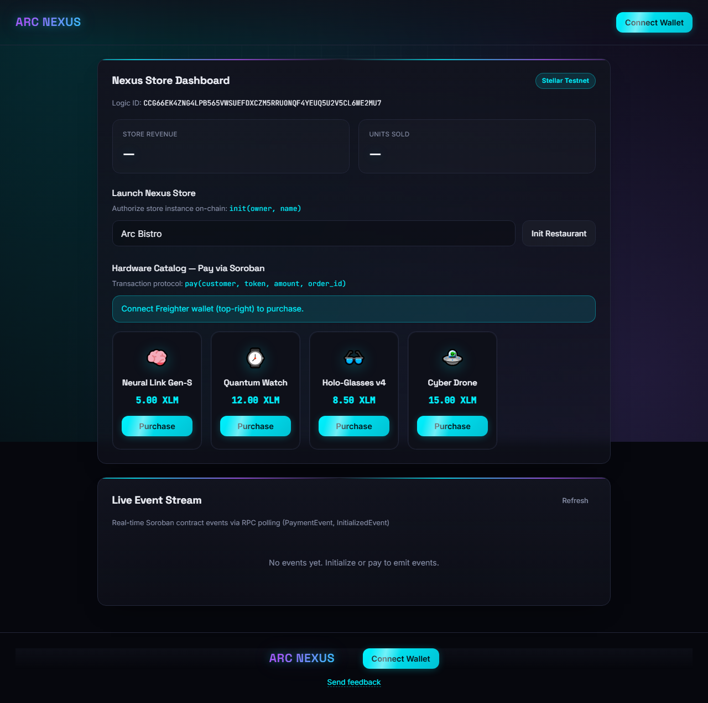
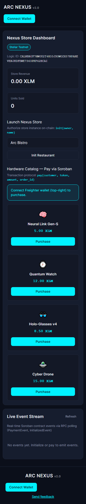
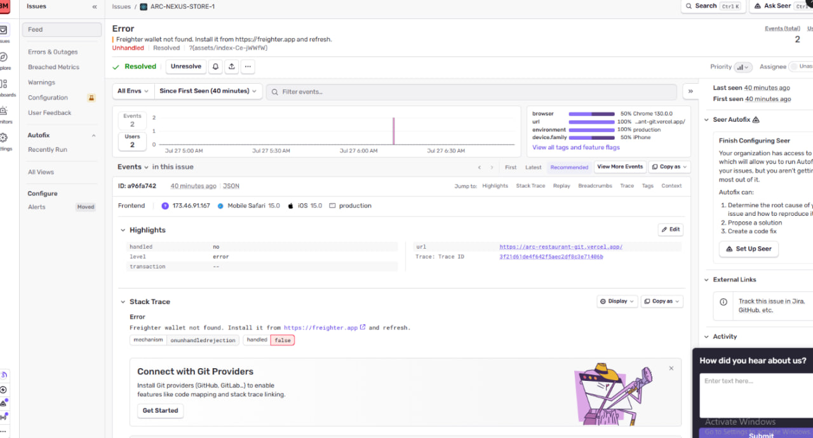
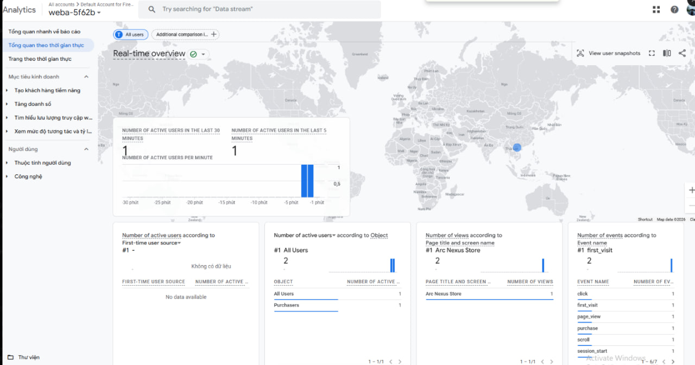

# Arc Nexus Store

[](https://github.com/okokok04/arc-nexus-store/actions/workflows/ci.yml)
[](https://opensource.org/licenses/MIT)
[](https://stellar.org)
[](https://soroban.stellar.org)

**Arc Nexus Store** is a Soroban-powered restaurant/store payment dApp on Stellar. Customers connect a Freighter wallet, the owner initializes the store on-chain, and every purchase calls the deployed smart contract directly — no backend, no custodian.

## Live Demo

- **Frontend**: [arc-restaurant-git.vercel.app](https://arc-restaurant-git.vercel.app/)
- **Contract (Testnet)**: `CDRGTQ466OLVQDYDTZKXY4J5AWJOJSIJSN3U2CSWHYXD4L7JYU5VXY6N`
- **Demo video**: _pending_ — script ready at [docs/DEMO_SCRIPT.md](docs/DEMO_SCRIPT.md)
- **Pitch deck**: [Arc Nexus Store — Pitch Deck](https://claude.ai/code/artifact/a777089c-395c-4a6d-90f7-0955b99001dc) (problem, solution, architecture, market, traction, growth, roadmap)

## Screenshots

| Desktop | Mobile (375px) |
|---|---|
|  |  |

| Sentry (real production error) | GA4 Realtime (real purchase event) |
|---|---|
|  |  |

## Key Features

- **Wallet integration** — Freighter connect/disconnect via `@stellar/freighter-api`, with network/account checks before every signature
- **Real on-chain calls** — `init` and `pay` are built, simulated, signed, and submitted through `@stellar/stellar-sdk` (`Contract`, `TransactionBuilder`, `rpc.Server`), not mocked
- **Testnet auto-funding** — one-click Friendbot funding with a fallback link to Stellar Laboratory
- **Live event stream** — polls Soroban RPC `getEvents` for `init`/`pay` contract events in real time
- **Monitoring** — Sentry error tracking and GA4 analytics, wired in `src/lib/monitoring.js` (enabled once DSN/measurement ID are configured)
- **Feedback link** — footer link to a feedback form/mailto, configurable via `VITE_FEEDBACK_URL`
- **Mobile responsive UI** — single-column layout, stacked forms/actions below 640px

## Smart Contract

`contracts/restaurant` — a Soroban contract (`soroban-sdk` 22) exposing:

| Function | Description |
|---|---|
| `init(owner, name)` | One-time store initialization |
| `pay(customer, token, amount, order_id)` | Transfers `amount` of `token` from customer to owner, updates revenue/order count |
| `get_owner`, `get_name`, `get_balance`, `get_order_count` | Read-only views |

### Test output

```text
running 4 tests
test test::test_init_sets_owner_and_name ... ok
test test::test_init_twice_panics - should panic ... ok
test test::test_pay_zero_amount_panics - should panic ... ok
test test::test_pay_transfers_tokens_and_updates_balance ... ok

test result: ok. 4 passed; 0 failed; 0 ignored; finished in 0.03s
```

## Getting Started

```bash
npm install
cp .env.example .env   # fill in VITE_CONTRACT_ID at minimum
npm run dev
```

Build the contract and run its Rust test suite:

```bash
npm run contract:build
npm run contract:test
```

Deploy to testnet (requires a funded deployer key — see `scripts/deploy-contract.mjs`):

```bash
npm run contract:deploy
```

## Tech Stack

- **Frontend**: React 18, Vite, Tailwind CSS
- **Stellar**: `@stellar/stellar-sdk`, `@stellar/freighter-api`, Soroban RPC
- **Contract**: Rust, `soroban-sdk` 22
- **CI/CD**: GitHub Actions (`ci.yml` lint/test/build, `deploy-contract.yml` testnet deploy)

## Project Structure

```
src/
  components/   RestaurantPanel, WalletConnect, EventStream, PurchaseConfirmModal, FeedbackLink
  context/      WalletContext (Freighter wallet state)
  hooks/        useWallet, useEventStream
  lib/          soroban.js (SDK calls), contract.js (contract config/menu), account.js (Friendbot/error mapping), monitoring.js
contracts/
  restaurant/   Soroban contract source + tests
```

## User Growth & Feedback (Level 5 — target: 50 real testers)

The footer "Send feedback" link routes to `VITE_FEEDBACK_URL` (a form or mailto). For structured, at-scale feedback:

- **Tester form**: [Arc Nexus Store — Tester Feedback](https://docs.google.com/forms/d/e/1FAIpQLSe-9bQUDVFaiBA04WXpTfBHxT3wMfCDB6-Q2FvwzgE8XMeiFg/viewform) — live, 7 fields (wallet address, email, name, ease-of-use rating, free-text feedback)
- **Form response sheet (live)**: [Arc Nexus Store — Tester Feedback (Responses)](https://docs.google.com/spreadsheets/d/1xosUOwzocsZf06ixRAp-2RNWfG2ScoFiNAvG0BYH2qQ/edit?usp=sharing) — 54 responses
- **Form response export (static backup)**: [docs/Tester_Feedback_Responses.xlsx](docs/Tester_Feedback_Responses.xlsx) / [.csv](docs/Tester_Feedback_Responses.csv) — snapshot of all 54 responses, kept in-repo so the record survives even if sharing settings on the live sheet change
- **On-chain activity export (Excel)**: [docs/ARC_NEXUS_ACTIVITY_LOG.xlsx](docs/ARC_NEXUS_ACTIVITY_LOG.xlsx) 
- **Recruitment plan + ready-to-post messages**: [docs/USER_RECRUITMENT.md](docs/USER_RECRUITMENT.md)

Current status:
- **Google Form responses: 54** (per the form's own response counter) — [view responses](https://docs.google.com/spreadsheets/d/1xosUOwzocsZf06ixRAp-2RNWfG2ScoFiNAvG0BYH2qQ/edit?usp=sharing)

Verified on-chain via direct RPC (`get_order_count` = 78, `get_balance` = 769.5 XLM on the current contract) — individually logged in [docs/USER_RECRUITMENT.md §3a](docs/USER_RECRUITMENT.md#3a-contract-v2-activity-post-level-5-auth-fix) 

## Growth Strategy

Recruit where wallet-holders already are (Stellar Developer Discord, r/stellar, X, personal network), route every channel to the same feedback form, batch outreach 2-3 channels/day so one wave's support questions get fixed before the next wave arrives. Full plan: [docs/USER_RECRUITMENT.md §2a](docs/USER_RECRUITMENT.md#2a-scaling-to-50-users-level-5).

## Product Iteration Log

Real engineering feedback from testing this app (see [docs/USER_RECRUITMENT.md §3b](docs/USER_RECRUITMENT.md#3b-engineering-feedback-from-testing-this-session--not-a-substitute-for-real-user-feedback)) turned directly into shipped fixes:

| Feedback | Fix | Commit |
|---|---|---|
| `init()` had no `require_auth()` — anyone could claim ownership of a fresh, uninitialized contract (front-running risk) | Added `owner.require_auth()`, redeployed contract, verified all read functions | [`b2df24d`](https://github.com/okokok04/arc-nexus-store/commit/b2df24d) |
| Real Sentry event showed a mobile Safari visitor hitting a generic "wallet not found" error — Freighter has no mobile app | Mobile browsers now get an honest, actionable message instead | [`b2df24d`](https://github.com/okokok04/arc-nexus-store/commit/b2df24d) |
| Funding flow only became visible after connecting a wallet — first-time visitors didn't know what to expect | Added a 3-step onboarding hint (connect → fund → buy) visible before connecting | [`b2df24d`](https://github.com/okokok04/arc-nexus-store/commit/b2df24d) |
| `simulateContractCall` used an unfunded placeholder account; current testnet RPC can't XDR-decode simulation responses for a source account that doesn't exist on-ledger — reliable "Bad union switch" errors | Root-caused to `@stellar/stellar-sdk` being 3 major versions behind (13.3.0 → 16.2.0); upgraded and verified end-to-end | [`45a80b5`](https://github.com/okokok04/arc-nexus-store/commit/45a80b5) |

**Next iteration**: once the 50-tester form (above) has real responses, the top 2-3 recurring themes from the free-text feedback column become the next rows in this table — each one shipped as its own commit, linked here the same way. The current front-runner from the roadmap is a mobile-compatible signing path (WalletConnect or similar), since "desktop only" is the most consequential known gap.

## Roadmap

- **Shipped**: contract auth fix, mobile-visitor messaging, clearer onboarding, monitoring (Sentry + GA4) live with real captured data, CI/CD fully green, SDK upgrade fixing simulation reliability
- **Now**: run the 50-tester recruitment push, collect structured feedback via the form above
- **Next**: mobile wallet signing path (closes the most-cited gap), feedback-driven UX pass
- **Later**: security audit + mainnet deployment, pilot with one real merchant taking real payments

## License

MIT
